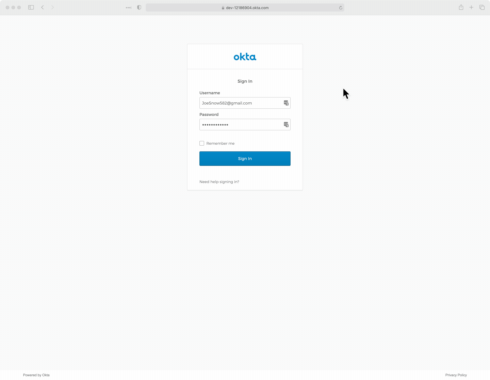

[](https://www.codacy.com/gh/northernjay885/reporting-system-aws/dashboard?utm_source=github.com&amp;utm_medium=referral&amp;utm_content=northernjay885/reporting-system-aws&amp;utm_campaign=Badge_Grade)

# Report Generating System on AWS
 This project is used mainly for demonstrating purpose. It can generate both excel and pdf format reports from a json file through a website. In the beginning, the user would be asked to authenticate himself. After logging in, the user can perform operations like creating the reports, downloading from AWS S3 bucket and deleting previous records through the website.
## Getting Started
 The project can be reached at an [EC2 instance](http://ec2-52-90-176-41.compute-1.amazonaws.com:8080).<br>

 The test user can be used to access the administration console. <br>
 
 Account Id:
 ```
 JoeSnow582@gmail.com
 ```
 Password:
 ```
 78MmaoY6g5N#
 ```

The below is a demo to show the features of the application.

 

## What has been improved
1. Used S3 bucket to store the generated reports in the excel service. Previously, the local storage can pose unnecessary challenge when we dockerize the application.
2. Updated Client Service to use AWS RDS MySQL database for storing records.
3. Added delete feature to support more crud operation in the console. The feature is realized through a SQS fifo Queue. The front UI for actions have been adopted to use a dropdown menu accordingly.
4. Used AWS DynamoDB for both ExcelRepositoryImpl and PDFRepositoryImpl.
5. Updated Sync API to use a fixedSizeThreadPool(2) and ReentrantLock to enable multithreading.
6. Added Eureka service for service discovery and decoupled the client service into microservice.
7. Used Spring Cloud Config to enable the feature of setting application.properties in the cloud.
8. Changed the REST client from RestTemplate to FeignClient to utilize the benefits of service discovery.
9. Set up fallback service for Sync API using Resilience4J in FeignClient.
10. Set up DeadLetter Queue for all the AWS SQS service.
11. Used HTTP basic authentication for all backend services to protect the backend services. 
12. Utilized OKTA OAUTH2.0 authentication for Client Service, and the user will be asked to login before using the sevice.
13. Set up a CI pipeline using Github Action to build the project.
14. Dockerized these microservices using fabric8 maven-plugin and deployed them on AWS through docker compose.

## What can be expected in the future
1. The code coverage can be improved by writing more tests, however, I hate writing tests.
2. A better way of implementing the CRUD operation in microservices should be saga pattern, but the service now just used a fifo queue to ensure the delete operation can act like a transaction without rollback feature.
3. The other CRUD operation can be further implemented, but I considered it unnecessary because the user can achieve update feature through deleting and creating.
4. The communication between microservices has not been encrypted, and it can improved through OAUTH2.0 Authorization features.
5. There is a way to utilize a docker compose yaml file to directly deploy these containers on AWS ECS, but I encounter some bugs in AWS cloudFormation. Will try again later.

## Notes
1. The yaml file has not been committed to github, because it contains many environment variables and AWS Secret.

## License
The content of this project itself is licensed under the [Creative Commons Attribution 3.0 Unported license](https://creativecommons.org/licenses/by/3.0/), and the underlying source code used to format and display that content is licensed under the [MIT license](LICENSE.md).

